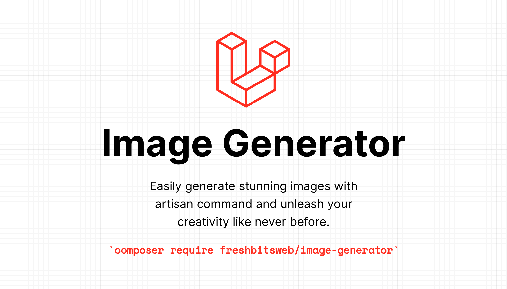

# Image generator for Laravel

[](https://packagist.org/packages/freshbitsweb/image-generator-for-laravel)
[](https://github.com/freshbitsweb/image-generator-for-laravel/actions?query=workflow%3Arun-tests+branch%3Amain)
[](https://github.com/freshbitsweb/image-generator-for-laravel/actions?query=workflow%3A"Fix+PHP+code+style+issues"+branch%3Amain)
[](https://packagist.org/packages/freshbitsweb/image-generator-for-laravel)

Generate images in your Laravel projects.

<p>
    We are excited to announce a new feature that will allow you to generate custom images with your chosen text. With this feature, you can add a personal touch to your visual content by including your name or any text you desire.
</p>

Our image generation technology is state-of-the-art, producing high-quality, visually stunning images that are sure to impress. Our team has put a lot of effort into perfecting this feature to ensure that the images generated are super duper cool as per your requirements.

To use this feature, simply provide us with the text you want to include in the image, and our system will do the rest. You can customize the font, color, and style of the text to ensure that it fits your needs perfectly.

We're excited to offer this new feature and can't wait for you to try it out. If you have any questions or feedback, please don't hesitate to [let us know](mailto:info@freshbits.in).

## Installation

You can install the package via composer:

```bash
composer require freshbitsweb/image-generator-for-laravel
```

You can publish the config file with:

```bash
php artisan vendor:publish --tag="image-generator-for-laravel-config"
```

## Usage

// TODO:

## Testing

```bash
composer test
```

## Changelog

Please see [CHANGELOG](CHANGELOG.md) for more information on what has changed recently.

## Contributing

Please see [CONTRIBUTING](CONTRIBUTING.md) for details.

## Security Vulnerabilities

Please review [our security policy](../../security/policy) on how to report security vulnerabilities.

## Credits

- [Utsav Somaiya](https://github.com/utsavsomaiya)
- [Gaurav Makhecha](https://github.com/gauravmak)
- [All Contributors](../../contributors)

## License

The MIT License (MIT). Please see [License File](LICENSE.md) for more information.
